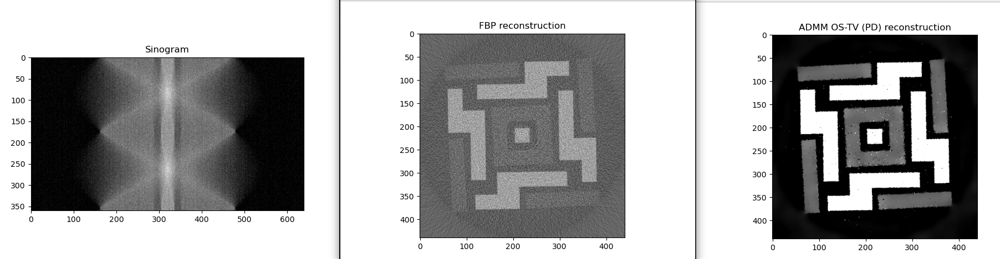

# Change Log

## v.2026.3.0.0

We apologise for the abrupt change, but starting from this version, iterative reconstruction methods will no longer be accessible through the `RecToolsIR` class. Only `RecToolsIRCuPy` will be supported going forward.

The primary reason for this decision is our intention to remove the dependency on the Regularisation Toolkit. Our goal is to move toward a fully CuPy-based solution that does not rely on pre-built external libraries, is quick to install, and remains effectively OS-agnostic. Maintaining compatibility with the pre-built Regularisation Toolkit, while simultaneously supporting two reconstruction classes — `RecToolsIR` (dependent on it) and `RecToolsIRCuPy` (independent of it) — has become increasingly time-consuming and difficult to justify. Especially as the software being in production where only methods from `RecToolsIRCuPy` are in use.

Moreover, the practical benefit of continuing to maintain `RecToolsIR` is limited, as the corresponding methods implemented in `RecToolsIRCuPy are significantly faster and more efficient.

We are actively developing `RecToolsIRCuPy, and further improvements are ongoing. Please note that additional breaking changes may occur in future releases as development progresses.

We appreciate your understanding and patience during this transition. The access to `RecToolsIR` still possible from older versions.

Changes:
* `RecToolsIR` class and all associated tests being removed. The old demos are still available in `methods_IR_legacy`.
* Dependency on [Regularisation Toolkit](https://github.com/TomographicImaging/CCPi-Regularisation-Toolk) is dropped.
* Significant refactoring of `RecToolsIRCuPy` and the breaking change that removes `datafidelity` from the class and one can control fidelities from the `_data_` dictionary given as `_data_["data_fidelity"]`.
* Ordered Subsets Expectation Maximization (OSEM) and MLEM added in `RecToolsIRCuPy` for emission-type data.
* Upgrade of dependencies to CuPy 14.* and numpy 2.4.

## v.2026.2.0.0

The ADMM implementation has been replaced with a new linearised variant that avoids the use of SciPy linear algebra solvers and instead relies directly on gradient-descent–type iterations. With appropriate parameter selection, this approach converges quickly and exhibits improved numerical stability.

Rewriting ADMM in this linearised form also enabled further acceleration through the use of CuPy and ordered subsets. When warm-started with an FBP reconstruction and combined with ADMM-OS and regularisation, the reconstruction can be performed very efficiently, often requiring only a few iterations (e.g., the reconstruction bellow is done with 24 subsets and 2 iterations of the method).

  

## v.2026.1.0.0

To better communicate breaking changes, ToMoBAR is moving from calendar versioning to semantic versioning (mixed). The initial `2026.1.0.0` release is based on the `2025.12` version.

## v.2025.10

### Changed
`DetectorsDimH_pad` parameter works now in CuPy iterative methods available in `RecToolsIRCuPy` class.
This allows reconstructing without artifacts on the edges of the reconstruction grid. Especially useful for
reconstructing data that is larger than the field of view.

### Fixed
SIRT CuPy algorithm has been fixed.

### New
FISTA iterative method in `RecToolsIRCuPy` dropped its dependency on Regularisation Toolkit. Currently two regularisers
available to use: `PD_TV` and `ROF_TV` and they were accelerated and optimised. Therefore FISTA with CuPy is up to 3 times faster compared
to the previous version and potentially a magnitude faster compared to FISTA in `RecToolsIR`.

## v.2025.08

### Changed
- $\sf\color{red}Breaking$ $\sf\color{red}changes!$ The API for initializing geometry in both direct and iterative methods (the `RecTools` class) has been updated. A new parameter, `DetectorsDimH_pad`, has been [introduced](https://dkazanc.github.io/ToMoBAR/api/tomobar.methodsDIR.html) to control edge padding along the detector's horizontal dimension. This parameter can help reduce circular/arc [artifacts](https://dkazanc.github.io/ToMoBAR/tutorials/real_data_recon.html) in reconstructions, such as saturated circles or arcs. See updated [Tutorials](https://dkazanc.github.io/ToMoBAR/tutorials/direct_recon.html) and [Demos](https://github.com/dkazanc/ToMoBAR/tree/master/Demos/Python).
- Log-Polar method (`FOURIER_INV` in `RecToolsDIRCuPy`) has been further accelerated and it is significantly faster FBP.

