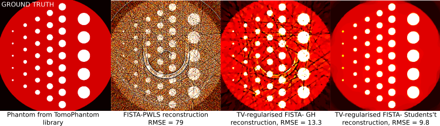

ToMoBAR's documentation
=======================

**ToMoBAR** (cite [CT2020]_, [SX2022]_) is a Python library of direct and model-based
regularised iterative reconstruction algorithms with a
plug-and-play capability. ToMoBAR offers you a selection
of various data models and regularisers resulting in complex
objectives for tomographic reconstruction. ToMoBAR can operate
in GPU device-to-device fashion on CuPy arrays therefore ensuring
a better computational efficiency. With GPU device controlling API
exposed it can also support multi-GPU parallel computing.

See more in :ref:`intro_about` or go directly to :ref:`ref_installation` and try `Demos <https://github.com/dkazanc/ToMoBAR/tree/master/Demos/Python>`_.

