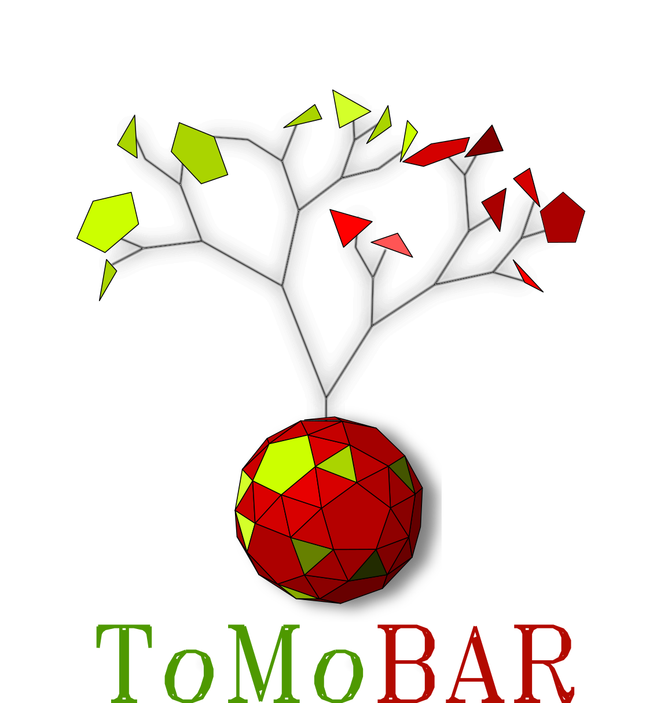

<table>
    <tr>
        <td>
        <div align="left">
          <br>  
        </div>
        </td>
        <td>
        <font size="5"><b> TOmographic MOdel-BAsed Reconstruction software <a href="https://github.com/dkazanc/ToMoBAR/tree/master/docs/Kazantsev_CT_20.pdf">PAPER (CT Meeting 2020)</a></b></font>     
        <br><font size="3" face="verdana" color="green"><b> ToMoBAR</b> is a Python and Matlab (not currently maintained) library of direct and model-based regularised iterative reconstruction algorithms with a plug-and-play capability. ToMoBAR offers you a selection of various data models and regularisers resulting in complex objectives for tomographic reconstruction. ToMoBAR can handle multi-GPU parallel reconstruction in Python and also device-to-device methods operating on CuPy arrays. </font></br>
        </td>
    </tr>
</table>

| Master | Anaconda binaries |
|--------|-------------------|
| [](https://github.com/dkazanc/ToMoBAR/actions) |   [ ](https://anaconda.org/dkazanc/tomobar/) |

### Software includes:
 * A wrapper around [ASTRA-toolbox](https://www.astra-toolbox.com/) to simplify access to various reconstruction methods available in ASTRA
 * Regularised iterative ordered-subsets [FISTA](https://epubs.siam.org/doi/10.1137/080716542) reconstruction algorithm with linear and non-linear data fidelities
 * Regularised iterative [ADMM](https://ieeexplore.ieee.org/document/7744574/) reconstruction algorithm
 * [Access to multi-GPU capability through mpi4py library](https://github.com/dkazanc/ToMoBAR/blob/master/Demos/Python/MultiGPU_demo.py)
 * CuPy driven [forward/backward projectors](https://github.com/dkazanc/ToMoBAR/blob/master/Demos/Python/Demo_CuPy_3D.py) to enable faster device-to-device operations and all in GPU memory protoyping of algorithms
 * [Demos](https://github.com/dkazanc/ToMoBAR/tree/master/Demos) to reconstruct synthetic and also real data [4-6]

<div align="center">
  
</div>
<div align="center">
    
</div>

## Software highlights:
 * Tomographic parallel-beam projection data can be simulated without the "inverse crime" using [TomoPhantom](https://github.com/dkazanc/TomoPhantom). Noise and artifacts (zingers, rings, jitter) can be modelled and added to the data.
 * Simulated data reconstructed iteratively using FISTA or ADMM algorithms with multiple "plug-and-play" regularisers from [CCPi-RegularisationToolkit](https://github.com/vais-ral/CCPi-Regularisation-Toolkit) and GPU-accelerated wavelets from [pypwt](https://github.com/pierrepaleo/pypwt).
 * The FISTA algorithm offers various modifications: convergence acceleration with ordered-subsets method; data fidelities: PWLS, Kullback-Leibler, Huber, Group-Huber[2], Students't [3,4], and SWLS [5] to deal with noise and imaging artifacts (rings, streaks).

### General software prerequisites
 * Python or [MATLAB](http://www.mathworks.com/products/matlab/) (not actively maintained currently)

### Software dependencies
 * [ASTRA-toolbox](https://www.astra-toolbox.com/) for projection operations
 * [TomoPhantom](https://github.com/dkazanc/TomoPhantom) for tomographic data and phantoms simulations
 * [CCPi-RegularisationToolkit](https://github.com/vais-ral/CCPi-Regularisation-Toolkit) for regularisation [7]
 * Wavelet toolbox [pypwt](https://github.com/pierrepaleo/pypwt) if wavelet regularisation is used (optional)
 * [mpi4py](https://mpi4py.readthedocs.io/en/stable/) for multi-GPU reconstruction control
 * [cupy](https://cupy.dev/) for GPU memory device-to-device operability
 * See [INSTALLATION](https://github.com/dkazanc/TomoRec/blob/master/INSTALLATION) for detailed information

### Python conda:
Install the ToMoBAR package from one of conda channels bellow:
```console
conda install -c dkazanc tomobar
conda install -c savu-dep tomobar
```

 or build using provided conda recipe:
```console
export VERSION=`date +%Y.%m` (unix) / set VERSION=2023.04 (Windows)
conda build conda-recipe/ --numpy 1.23 --python 3.10
conda install -c file://${CONDA_PREFIX}/conda-bld/ tomobar --force-reinstall
```
### Python development environment
* Clone the repository from GitHub page
* Install dependencies from the environment file (or from explicit list file)
* Activate the environment with :code:`conda activate tomobar`
* From the root directory install the enviroment in development mode with :code:`pip install -e .[dev]`

### MultiGPU capability
ToMoBAR can be used by running in parallel across multiple GPU devices on a PC or a compute node of a cluster. In order to initiate a parallel run on multiple GPUs you will need an MPI library, such as, [mpi4py](https://mpi4py.readthedocs.io/en/stable/). See this [demo](https://github.com/dkazanc/ToMoBAR/blob/master/Demos/Python/MultiGPU_demo.py).

### Matlab (is not currently supported)
Use available m-functions, see [Demos](https://github.com/dkazanc/ToMoBAR/tree/master/Demos/Matlab).

## How to use ToMoBAR in Python:
Please check [Demos](https://github.com/dkazanc/ToMoBAR/tree/master/Demos/Python) and also [Documetation](https://dkazanc.github.io/ToMoBAR/) with more detailed recipies how to run.

A typical setup for iterative reconstruction would include building three dictionaries: `_data_`, `_algorithm_` and `_regularisation_`. To list all accepted parameters for dictionaries do: 
```python
from tomobar.supp.dicts import dicts_check
help(dicts_check)
```
<div align="left">
    
</div>

### References:
 1. [D. Kazantsev and N. Wadeson 2020. TOmographic MOdel-BAsed Reconstruction (ToMoBAR) software for high resolution synchrotron X-ray tomography. CT Meeting 2020](https://github.com/dkazanc/ToMoBAR/tree/master/docs/Kazantsev_CT_20.pdf)
 2. [P. Paleo and A. Mirone 2015. Ring artifacts correction in compressed sensing tomographic reconstruction. Journal of synchrotron radiation, 22(5), pp.1268-1278.](https://doi.org/10.1107/S1600577515010176)
 3. [D. Kazantsev et al. 2017. A Novel Tomographic Reconstruction Method Based on the Robust Student's t Function For Suppressing Data Outliers. IEEE TCI, 3(4), pp.682-693.](https://doi.org/10.1109/TCI.2017.2694607)
 4. [D. Kazantsev et al. 2017. Model-based iterative reconstruction using higher-order regularization of dynamic synchrotron data. Measurement Science and Technology, 28(9), p.094004.](https://doi.org/10.1088/1361-6501/aa7fa8)
 5. [H. Om Aggrawal et al. 2017. A Convex Reconstruction Model for X-ray tomographic Imaging with Uncertain Flat-fields", IEEE Transactions on Computational Imaging](http://ieeexplore.ieee.org/document/7967846/)
 6. [V. Van Nieuwenhove et al. 2015. Dynamic intensity normalization using eigen flat fields in X-ray imaging. Optics express 23(21)](https://visielab.uantwerpen.be/sites/default/files/ffc_2016.pdf).

### Applications (where ToMoBAR software have been used or referenced):
 7. [D. Kazantsev et al. 2019. CCPi-Regularisation toolkit for computed tomographic image reconstruction with proximal splitting algorithms. SoftwareX, 9, pp.317-323.](https://doi.org/10.1016/j.softx.2019.04.003)
 8. [E. Guo et al. 2018. The influence of nanoparticles on dendritic grain growth in Mg alloys. Acta Materialia.](https://doi.org/10.1016/j.actamat.2018.04.023)
 9. [E. Guo et al. 2018. Revealing the microstructural stability of a three-phase soft solid (ice cream) by 4D synchrotron X-ray tomography. Journal of Food Engineering](https://www.sciencedirect.com/science/article/pii/S0260877418302309)
 10. [E. Guo et al. 2017. Dendritic evolution during coarsening of Mg-Zn alloys via 4D synchrotron tomography. Acta Materialia](https://doi.org/10.1016/j.actamat.2016.10.022)
 11. [E. Guo et al. 2017. Synchrotron X-ray tomographic quantification of microstructural evolution in ice cream–a multi-phase soft solid. Rsc Advances](https://doi.org/10.1039/C7RA00642J)
 12. [Liu Shi et al. 2020. Review of CT image reconstruction open source toolkits, Journal of X-Ray Science and Technology](https://content.iospress.com/articles/journal-of-x-ray-science-and-technology/xst200666)

### License:
GNU GENERAL PUBLIC LICENSE v.3

### Questions/Comments
can be addressed to Daniil Kazantsev at dkazanc@hotmail.com
