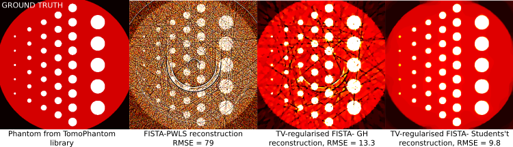

<table>
    <tr>
        <td>
        

           
        

        </td>
        <td>
        <b> TOmographic MOdel-BAsed Reconstruction software <a href="https://github.com/dkazanc/ToMoBAR/tree/master/docs/Kazantsev_CT_20.pdf">PAPER (CT Meeting 2020)</a></b>
         <b> ToMoBAR</b> is a Python and Matlab (not currently maintained) library of direct and model-based regularised iterative reconstruction algorithms with a plug-and-play capability. ToMoBAR offers you a selection of various data models and regularisers resulting in complex objectives for tomographic reconstruction. ToMoBAR can handle multi-GPU parallel reconstruction in Python and also device-to-device methods operating on CuPy arrays.  
        </td>
    </tr>
</table>

| Master | Anaconda binaries |
|--------|-------------------|
|  |    |

### NEW in ToMoBAR since v.2024.12:
- Fixes to overcome some incompatibility issues in the new release of [CCPi-Regularisation-Toolkit](https://github.com/TomographicImaging/CCPi-Regularisation-Toolkit).
- [DOCUMENTATION](https://dkazanc.github.io/ToMoBAR/) is updated, [API](https://dkazanc.github.io/ToMoBAR/reference/api.html) references improved.

## ToMoBAR highlights:
Check what ToMoBAR can [do](https://dkazanc.github.io/ToMoBAR/introduction/about.html#what-tomobar-can-do). Please also see [Tutorials](https://dkazanc.github.io/ToMoBAR/tutorials/direct_recon.html) and [Demos](https://github.com/dkazanc/ToMoBAR/tree/master/Demos/Python).

## Installation
Please check the detailed [installation](https://dkazanc.github.io/ToMoBAR/howto/installation.html) guide where all [software dependencies](https://dkazanc.github.io/ToMoBAR/introduction/dependencies.html) are listed.

### Software includes:
 * A wrapper around [ASTRA-toolbox](https://www.astra-toolbox.com/) to simplify access to various reconstruction methods available in ASTRA
 * Regularised iterative ordered-subsets [FISTA](https://epubs.siam.org/doi/10.1137/080716542) reconstruction algorithm with linear and non-linear data fidelities
 * Regularised iterative [ADMM](https://ieeexplore.ieee.org/document/7744574/) reconstruction algorithm
 * CuPy driven [forward/backward projectors](https://github.com/dkazanc/ToMoBAR/blob/master/Demos/Python/Demo_CuPy_3D.py) to enable faster device-to-device operations and all in GPU memory protoyping of algorithms
* [Access to multi-GPU capability through mpi4py library](https://github.com/dkazanc/ToMoBAR/blob/master/Demos/Python/MultiGPU_demo.py)
 * [Demos](https://github.com/dkazanc/ToMoBAR/tree/master/Demos) to reconstruct synthetic and also real data [4-6]

  

  

### References:
 1. [D. Kazantsev and N. Wadeson 2020. TOmographic MOdel-BAsed Reconstruction (ToMoBAR) software for high resolution synchrotron X-ray tomography. CT Meeting 2020](https://github.com/dkazanc/ToMoBAR/tree/master/docs/Kazantsev_CT_20.pdf)
 2. [P. Paleo and A. Mirone 2015. Ring artifacts correction in compressed sensing tomographic reconstruction. Journal of synchrotron radiation, 22(5), pp.1268-1278.](https://doi.org/10.1107/S1600577515010176)
 3. [D. Kazantsev et al. 2017. A Novel Tomographic Reconstruction Method Based on the Robust Student's t Function For Suppressing Data Outliers. IEEE TCI, 3(4), pp.682-693.](https://doi.org/10.1109/TCI.2017.2694607)
 4. [D. Kazantsev et al. 2017. Model-based iterative reconstruction using higher-order regularization of dynamic synchrotron data. Measurement Science and Technology, 28(9), p.094004.](https://doi.org/10.1088/1361-6501/aa7fa8)
 5. [H. Om Aggrawal et al. 2017. A Convex Reconstruction Model for X-ray tomographic Imaging with Uncertain Flat-fields", IEEE Transactions on Computational Imaging](http://ieeexplore.ieee.org/document/7967846/)
 6. [V. Van Nieuwenhove et al. 2015. Dynamic intensity normalization using eigen flat fields in X-ray imaging. Optics express 23(21)](https://visielab.uantwerpen.be/sites/default/files/ffc_2016.pdf).

### Applications (where ToMoBAR software have been used or referenced):
 7. [D. Kazantsev et al. 2019. CCPi-Regularisation toolkit for computed tomographic image reconstruction with proximal splitting algorithms. SoftwareX, 9, pp.317-323.](https://doi.org/10.1016/j.softx.2019.04.003)
 8. [E. Guo et al. 2018. The influence of nanoparticles on dendritic grain growth in Mg alloys. Acta Materialia.](https://doi.org/10.1016/j.actamat.2018.04.023)
 9. [E. Guo et al. 2018. Revealing the microstructural stability of a three-phase soft solid (ice cream) by 4D synchrotron X-ray tomography. Journal of Food Engineering](https://www.sciencedirect.com/science/article/pii/S0260877418302309)
 10. [E. Guo et al. 2017. Dendritic evolution during coarsening of Mg-Zn alloys via 4D synchrotron tomography. Acta Materialia](https://doi.org/10.1016/j.actamat.2016.10.022)
 11. [E. Guo et al. 2017. Synchrotron X-ray tomographic quantification of microstructural evolution in ice cream–a multi-phase soft solid. Rsc Advances](https://doi.org/10.1039/C7RA00642J)
 12. [Liu Shi et al. 2020. Review of CT image reconstruction open source toolkits, Journal of X-Ray Science and Technology](https://content.iospress.com/articles/journal-of-x-ray-science-and-technology/xst200666)

### License:
GNU GENERAL PUBLIC LICENSE v.3

### Questions/Comments
can be addressed to Daniil Kazantsev at dkazanc@hotmail.com
