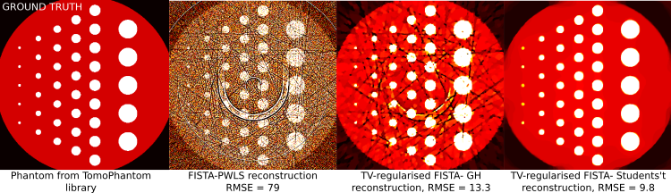
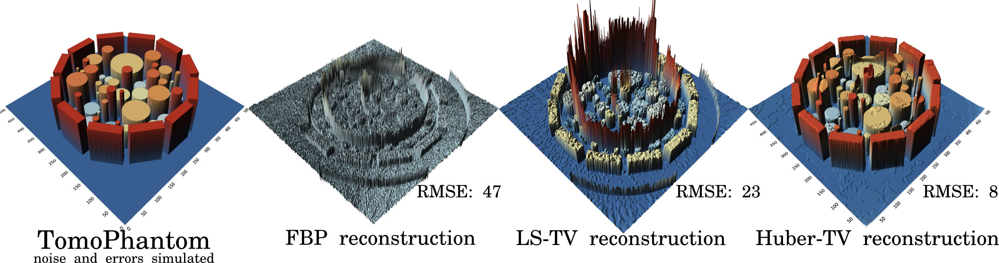

<table>
    <tr>
        <td>
        

           
        

        </td>
        <td>
        <b> TOmographic MOdel-BAsed Reconstruction software <a href="https://github.com/dkazanc/ToMoBAR/tree/master/docs/Kazantsev_CT_20.pdf">PAPER (CT Meeting 2020)</a></b>
         <b> ToMoBAR</b> is a Python library of fast direct and model-based regularised iterative  algorithms with a plug-and-play capability for reconstruction of parallel-beam geometry data. ToMoBAR offers you a selection of various data models and regularisers resulting in complex objectives for tomographic reconstruction. ToMoBAR can handle multi-GPU parallel reconstruction in Python and also device-to-device methods operating on CuPy arrays. It is currently used in production at <a href="https://www.diamond.ac.uk/Home.html">Diamond Light Source</a> as a part of the <a href="https://diamondlightsource.github.io/httomo/">HTTomo</a> framework for big-data processing and reconstruction. 
        </td>
    </tr>
</table>

| Master | Anaconda binaries |
|--------|-------------------|
|  |    |

## Anouncements:
*  $\sf\color{red}!$ Starting from version 2026.3.0.0, iterative reconstruction methods will no longer be accessible through the `RecToolsIR` class as `RecToolsIRCuPy` is provided instead. Please see more information in [CHANGELOG](https://github.com/dkazanc/ToMoBAR/blob/master/CHANGELOG.md)

### CHANGELOG:
See [CHANGELOG](https://github.com/dkazanc/ToMoBAR/blob/master/CHANGELOG.md) for all detailed changes.

### ToMoBAR highlights:
Check what ToMoBAR can [do](https://dkazanc.github.io/ToMoBAR/introduction/about.html#what-tomobar-can-do). Please also see [Tutorials](https://dkazanc.github.io/ToMoBAR/tutorials/direct_recon.html) and [Demos](https://github.com/dkazanc/ToMoBAR/tree/master/Demos/Python).
ToMoBAR

### Installation
Please check the detailed [installation](https://dkazanc.github.io/ToMoBAR/howto/installation.html) guide where all [software dependencies](https://dkazanc.github.io/ToMoBAR/introduction/dependencies.html) are listed.

### Software includes:
 * Wrappers around [ASTRA-toolbox](https://www.astra-toolbox.com/) to simplify access to various reconstruction methods available in ASTRA-Toolbox
 * CuPy driven forward/backward projectors to enable faster device-to-device operations and all-in-GPU memory prototyping of algorithms.
 * Optimised CUDA/CuPy implementation of the fast [Log-Polar]( https://epubs.siam.org/doi/10.1137/15M1023762) (Fourier-based) direct reconstruction method.
 * Regularisation modules that can be used for denoising or for regularisation in iterative methods.
 * Regularised iterative ordered-subsets [FISTA](https://epubs.siam.org/doi/10.1137/080716542) reconstruction algorithm with linear and non-linear data fidelities.
 * Regularised iterative ordered-subsets [ADMM](https://ieeexplore.ieee.org/document/7744574/) reconstruction algorithm. Very fast, especially with warm start, relaxation and ordered-subsets enabled.
 * [Demos](https://github.com/dkazanc/ToMoBAR/tree/master/Demos) to reconstruct synthetic and also real data

  

  

### To cite this software please use:
 [D. Kazantsev and N. Wadeson 2020. TOmographic MOdel-BAsed Reconstruction (ToMoBAR) software for high resolution synchrotron X-ray tomography. CT Meeting 2020](https://github.com/dkazanc/ToMoBAR/tree/master/docs/Kazantsev_CT_20.pdf)