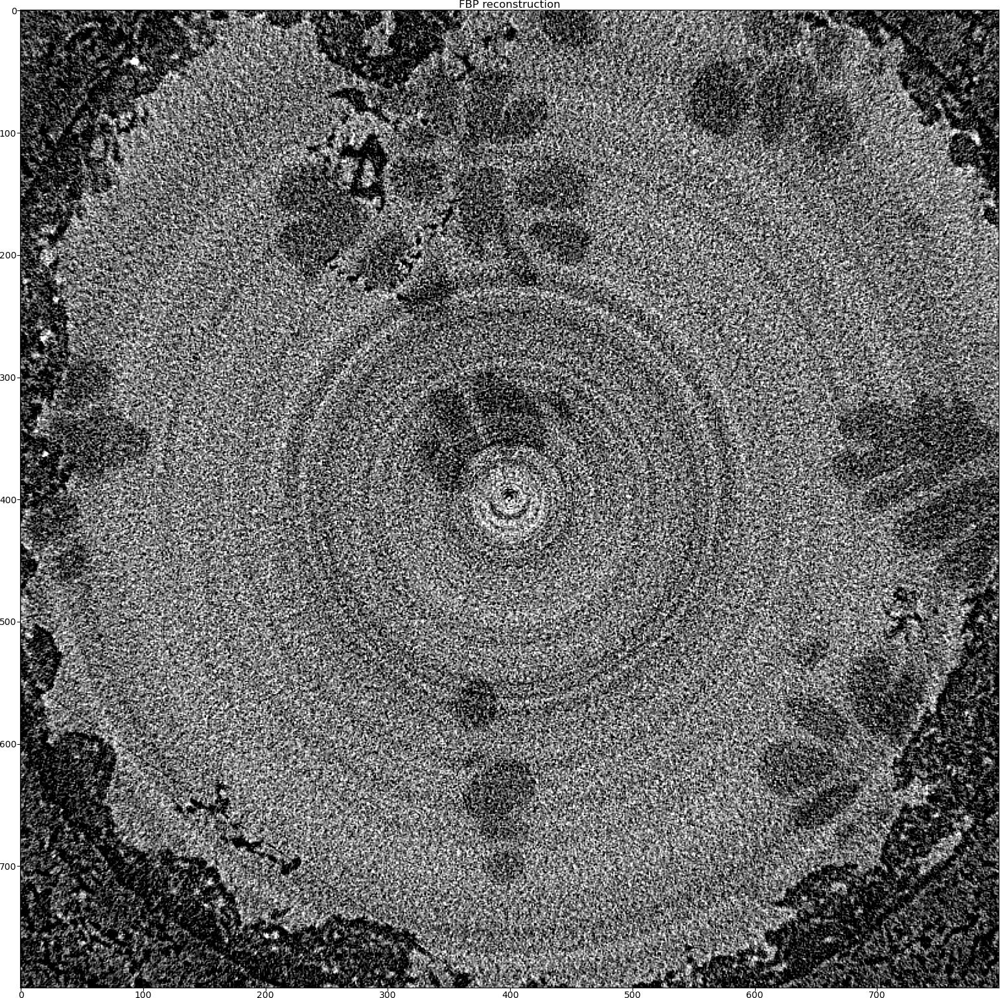

.. _examples_real_data:

Real data reconstruction
************************
This tutorial covers real data reconstruction using ToMoBAR software. The data is obtained at 
Diamond Light Source facility (UK synchrotron), i12 beamline. The sample is a magnesium allow
which undergoes some thermal changes in which the dendritic growth occurs. See more details about the 
experiment in [GUO2018]_ and more on reconstruction using ToMoBAR in [KAZ2017]_.

This tutorial loosely follows `Demo_RealData.py <https://github.com/dkazanc/ToMoBAR/blob/master/Demos/Python/Demo_RealData.py>`_ 
demo.

* We will extract a 2D sinogram out of 3D projection data and reconstruct it using the FBP method.

.. code-block:: python

    from tomobar.methodsDIR import RecToolsDIR
    data_labels2D = ["detX", "angles"]  # set the input data labels
    Rectools = RecToolsDIR(
    DetectorsDimH=detectorHoriz,  # Horizontal detector dimension
    DetectorsDimV=None,  # Vertical detector dimension
    CenterRotOffset=None,  # Center of Rotation scalar
    AnglesVec=angles_rad,  # A vector of projection angles in radians
    ObjSize=N_size,  # Reconstructed object dimensions (scalar)
    device_projector="gpu",
    data_axis_labels=data_labels2D,
    )

    FBPrec = Rectools.FBP(sinogram)

* Next we reconstruct using ordered-subsets FISTA with Total Variation regularisation.

.. code-block:: python
    
    from tomobar.methodsIR import RecToolsIR
    Rectools = RecToolsIR(
        DetectorsDimH=detectorHoriz,  # Horizontal detector dimension
        DetectorsDimV=None,  # Vertical detector dimension (3D case)
        CenterRotOffset=None,  # Center of Rotation scalar
        AnglesVec=angles_rad,  # A vector of projection angles in radians
        ObjSize=N_size,  # Reconstructed object dimensions (scalar)
        datafidelity="PWLS",  # Data fidelity term
        device_projector="gpu",
        data_axis_labels=data_labels2D,
    )

    _data_ = {
        "projection_norm_data": sinogram,  # Normalised projection data
        "projection_raw_data": sinogram_raw,  # Raw projection data
        "OS_number": 6,  # The number of subsets
    }
    lc = Rectools.powermethod(_data_)  # calculate Lipschitz constant
    
    _algorithm_ = {"iterations": 25, "lipschitz_const": lc}
   
    _regularisation_ = {
        "method": "PD_TV",  # Regularisation method
        "regul_param": 0.000002,  # Regularisation parameter
        "iterations": 60,  # The number of regularisation iterations
        "device_regulariser": "gpu",
    }
    
    RecFISTA = Rectools.FISTA(_data_, _algorithm_, _regularisation_)

.. figure::  ../_static/tutorial/real/FISTA_TV_dendr.jpg
    :scale: 25 %
    :alt: FISTA recon

* Then we will add the Group-Huber data fidelity model [PM2015]_ to minimise ring artefacts. 
  The only change will be the `_data_` dictionary.

.. code-block:: python
    
    _data_ = {
        "projection_norm_data": sinogram,  # Normalised projection data
        "projection_raw_data": sinogram_raw,  # Raw projection data
        "OS_number": 6,  # The number of subsets
        "ringGH_lambda": 0.000015, # GH model parameters
        "ringGH_accelerate": 6, # GH model parameters
    }
    
    RecFISTA = Rectools.FISTA(_data_, _algorithm_, _regularisation_)

.. figure::  ../_static/tutorial/real/FISTA_GH_TV_dendr.jpg
    :scale: 25 %
    :alt: FISTA recon

* We also try the Stripe-Weighted Least Squares data model [HOA2017]_.

.. code-block:: python
    
    _data_ = {
        "projection_norm_data": sinogram,  # Normalised projection data
        "projection_raw_data": sinogram_raw,  # Raw projection data
        "OS_number": 6,  # The number of subsets
        "beta_SWLS": 0.2,  #  parameter for the SWLS model
    }
    
    RecFISTA = Rectools.FISTA(_data_, _algorithm_, _regularisation_)

.. figure::  ../_static/tutorial/real/FISTA_SWLS_TV_dendr.jpg
    :scale: 25 %
    :alt: FISTA recon

As one can see that visually the SWLS model produced the best reconstruction here. 
This model is indeed works very well when the stripes (rings) are full and not partial.

.. [GUO2018] E. Guo et al. 2018. The influence of nanoparticles on dendritic 
   grain growth in Mg alloys. Acta Materialia.

.. [KAZ2017] D. Kazantsev et al. 2017. Model-based iterative 
   reconstruction using higher-order regularization of dynamic 
   synchrotron data. Measurement Science and Technology, 28(9), p.094004.

