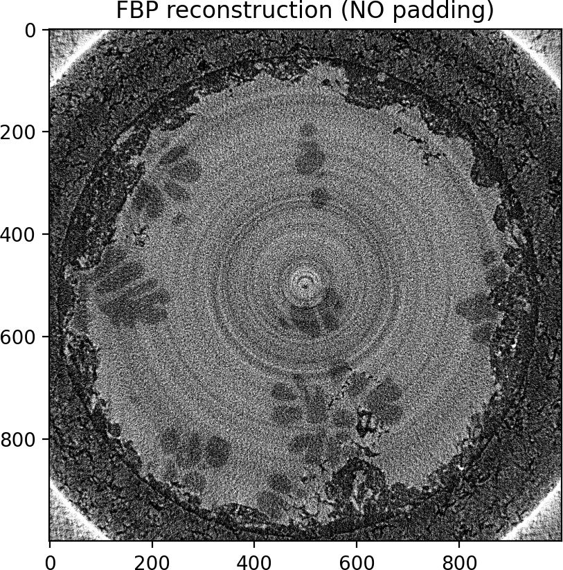
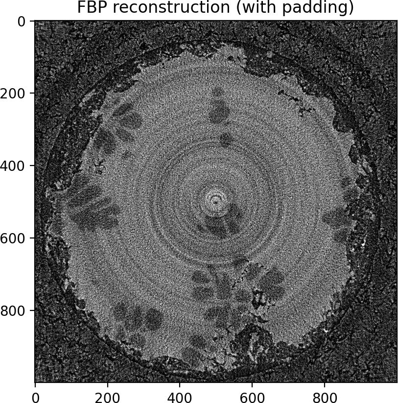
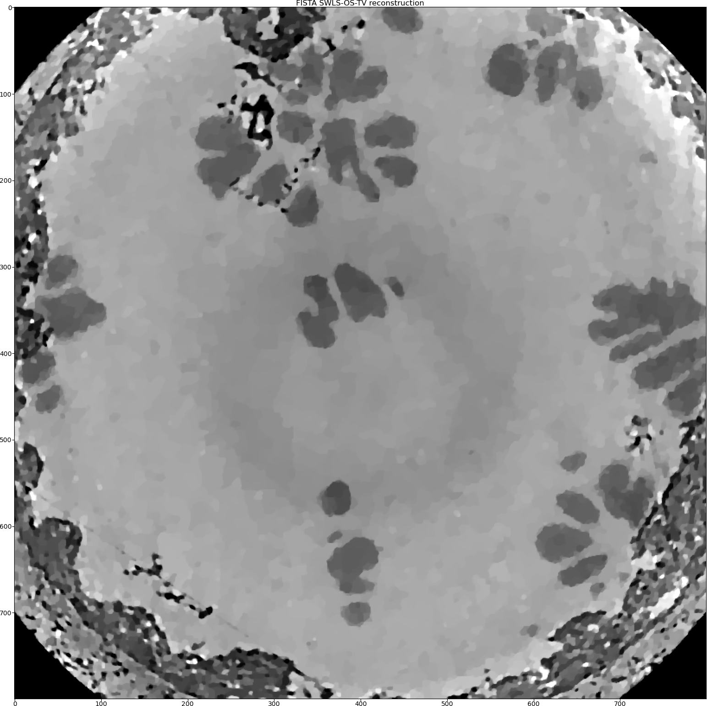

.. _examples_real_data:

Real data reconstruction
************************
This tutorial covers real data reconstruction using ToMoBAR software. The data is obtained at
Diamond Light Source facility (UK synchrotron), i12 beamline. The sample is a magnesium allow
which undergoes some thermal changes in which the dendritic growth occurs. See more details about the
experiment in [GUO2018]_ and more on reconstruction using ToMoBAR in [KAZ2017]_.

This tutorial loosely follows `Demo_RealData.py <https://github.com/dkazanc/ToMoBAR/blob/master/Demos/Python/Demo_RealData.py>`_
demo.

* We will extract a 2D sinogram out of 3D projection data and reconstruct it using the FBP method.

.. code-block:: python

    from tomobar.methodsDIR import RecToolsDIR

    Rectools = RecToolsDIR(
        DetectorsDimH=detectorHoriz,  # Horizontal detector dimension
        DetectorsDimH_pad=0,  # Padding size of horizontal detector
        DetectorsDimV=None,  # Vertical detector dimension
        CenterRotOffset=None,  # Center of Rotation scalar
        AnglesVec=angles_rad,  # A vector of projection angles in radians
        ObjSize=N_size,  # Reconstructed object dimensions (scalar)
        device_projector="gpu",
    )

    FBPrec = Rectools.FBP(sinogram, data_axes_labels_order=["detX", "angles"])

* In order to remove the circular artifact in the FBP reconstruction, one can edge-pad the horizontal detector.

.. code-block:: python

    from tomobar.methodsDIR import RecToolsDIR

    Rectools = RecToolsDIR(
        DetectorsDimH=detectorHoriz,  # Horizontal detector dimension
        DetectorsDimH_pad=100,  # Padding size of horizontal detector
        DetectorsDimV=None,  # Vertical detector dimension
        CenterRotOffset=None,  # Center of Rotation scalar
        AnglesVec=angles_rad,  # A vector of projection angles in radians
        ObjSize=N_size,  # Reconstructed object dimensions (scalar)
        device_projector="gpu",
    )

    FBPrec = Rectools.FBP(sinogram, data_axes_labels_order=["detX", "angles"])

* Next we reconstruct using ordered-subsets FISTA with Total Variation regularisation.

.. code-block:: python

    from tomobar.methodsIR import RecToolsIR

    Rectools = RecToolsIR(
        DetectorsDimH=detectorHoriz,  # Horizontal detector dimension
        DetectorsDimH_pad=0,  # Padding size of horizontal detector
        DetectorsDimV=None,  # Vertical detector dimension (3D case)
        CenterRotOffset=None,  # Center of Rotation scalar
        AnglesVec=angles_rad,  # A vector of projection angles in radians
        ObjSize=N_size,  # Reconstructed object dimensions (scalar)
        datafidelity="PWLS",  # Data fidelity term
        device_projector="gpu",
    )

    _data_ = {
        "projection_norm_data": sinogram,  # Normalised projection data
        "projection_raw_data": sinogram_raw,  # Raw projection data
        "OS_number": 6,  # The number of subsets
        "data_axes_labels_order": ["detX", "angles"],
    }
    lc = Rectools.powermethod(_data_)  # calculate Lipschitz constant

    _algorithm_ = {"iterations": 25, "lipschitz_const": lc}

    _regularisation_ = {
        "method": "PD_TV",  # Regularisation method
        "regul_param": 0.000002,  # Regularisation parameter
        "iterations": 60,  # The number of regularisation iterations
        "device_regulariser": "gpu",
    }

    RecFISTA = Rectools.FISTA(_data_, _algorithm_, _regularisation_)

.. figure::  ../_static/tutorial/real/FISTA_TV_dendr.jpg
    :scale: 25 %
    :alt: FISTA recon

* Then we will add the Group-Huber data fidelity model [PM2015]_ to minimise the ring artefacts.
  We need to add new parameters to the `_data_` dictionary.

.. code-block:: python

    _data_ = {
        "projection_norm_data": sinogram,  # Normalised projection data
        "projection_raw_data": sinogram_raw,  # Raw projection data
        "OS_number": 6,  # The number of subsets
        "data_axes_labels_order": ["detX", "angles"],
        "ringGH_lambda": 0.000015,
        "ringGH_accelerate": 6,
    }

    RecFISTA = Rectools.FISTA(_data_, _algorithm_, _regularisation_)

.. figure::  ../_static/tutorial/real/FISTA_GH_TV_dendr.jpg
    :scale: 25 %
    :alt: FISTA recon

* We also can try the Stripe-Weighted Least Squares (SWLS) data model [HOA2017]_. As we change the data fidelity, we need to re-initialise the geometry
  object.

.. code-block:: python

    Rectools = RecToolsIR(
        DetectorsDimH=detectorHoriz,  # Horizontal detector dimension
        DetectorsDimH_pad=0,  # Padding size of horizontal detector
        DetectorsDimV=None,  # Vertical detector dimension (3D case)
        CenterRotOffset=None,  # Center of Rotation scalar
        AnglesVec=angles_rad,  # A vector of projection angles in radians
        ObjSize=N_size,  # Reconstructed object dimensions (scalar)
        datafidelity="SWLS",  # Data fidelity term
        device_projector="gpu",
    )

    _data_ = {
        "projection_norm_data": sinogram,  # Normalised projection data
        "projection_raw_data": sinogram_raw,  # Raw projection data
        "OS_number": 6,  # The number of subsets
        "beta_SWLS": 0.2,  #  parameter for the SWLS model
        "data_axes_labels_order": ["detX", "angles"],
    }

    RecFISTA = Rectools.FISTA(_data_, _algorithm_, _regularisation_)

As one can see that visually the SWLS model produced the best reconstruction here.
This model is indeed works very well when the stripes (rings) are full and not partial.
