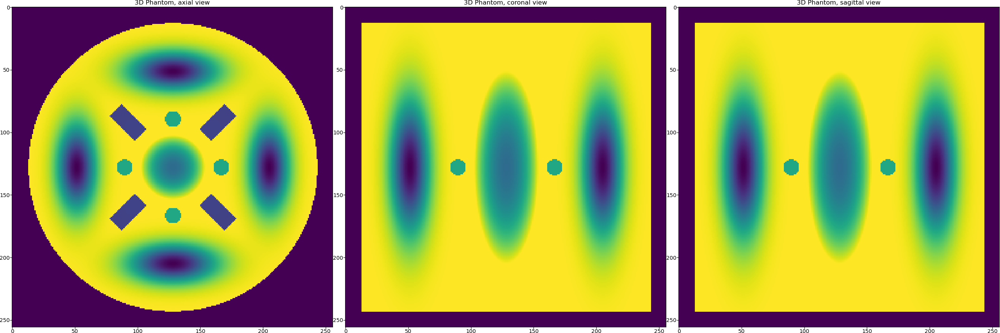
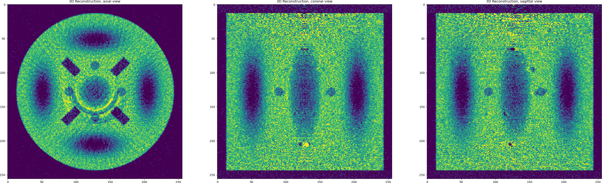

.. _examples_synth_iter:

Synthethic data reconstruction
******************************
This tutorial covers a concrete example when the data is synthetically generated using
`Tomophantom <https://github.com/dkazanc/TomoPhantom>`_ software and reconstructed using ToMoBAR.
We recommend installing TomoPhantom (see :ref:`ref_dependencies`) as most of **Demos** use it.
This tutorial loosely follows `DemoFISTA_real_artifacts3D <https://github.com/dkazanc/ToMoBAR/blob/master/Demos/Python/DemoFISTA_real_artifacts3D.py>`_ demo.

* Let us generate the 3D phantom first. For this we will use the model no.16 from the TomoPhantom's library of models.

.. code-block:: python

    import os
    import numpy as np
    import tomophantom
    from tomophantom import TomoP3D
    from tomophantom.qualitymetrics import QualityTools
    from tomophantom.flatsgen import synth_flats
    from tomobar.supp.suppTools import normaliser
    model = 16  # select a model number from the library of phantoms
    N_size = 256  # Define phantom dimensions using a scalar value (cubic phantom)
    path = os.path.dirname(tomophantom.__file__)
    path_library3D = os.path.join(path, "phantomlib", "Phantom3DLibrary.dat")
    # This will generate a N_size x N_size x N_size phantom (3D)
    phantom_tm = TomoP3D.Model(model, N_size, path_library3D)

* Once the phantom is generated we need to generate projection data, although the data
  in TomoPhantom is generated `analytically` and therefore it can be generated without the presence of the generated phantom. 

.. code-block:: python

    # Parallel-beam projection geometry related parameters:
    Horiz_det = int(np.sqrt(2) * N_size)  # detector column count (horizontal)
    Vert_det = N_size  # detector row count (vertical) (no reason for it to be > N)
    angles_num = int(0.5 * np.pi * N_size)
    # angles number
    angles = np.linspace(0.0, 179.9, angles_num, dtype="float32")  # in degrees
    angles_rad = angles * (np.pi / 180.0) # in radians
    projData3D_analyt = TomoP3D.ModelSino(
        model, N_size, Horiz_det, Vert_det, angles, path_library3D
    )

.. figure::  ../_static/tutorial/synth/sinogram3d.png
    :scale: 25 %
    :alt: 3D projecton data

* TomoPhantom offers a functionality to mimic flat fields that can be used later for normalisation. This normally leads to
  more realistic data generated. Note that the generated data has got the size of :mod:`[256, 402, 362]` with axes labels given as :mod:`["detY", "angles", "detX"]`.
  We now generate flats and the data with the background from the ideal analytical data. 

.. code-block:: python

    I0 = 15000 # Source intensity    
    flatsnum = 100  # the number of the flat fields simulated

    [projData3D_noisy, flatsSIM, speckles] = synth_flats(
        projData3D_analyt, # ideal analytical data
        source_intensity=I0, # affects the amount of the Poisson noise added to data
        detectors_miscallibration=0.02, # A constant which perturbs some detectors positions
        arguments_Bessel=(1, 10, 10, 12), # control background low-freq variations
        specklesize=5, # Speckle size in pixel units for flats background simulation
        kbar=0.3, # Mean photon density (photons per pixel) for background simulation
        jitter_projections=0.0, # no jitter to projections
        sigmasmooth=3, # blurring the speckled backround
        flatsnum=flatsnum, # the number of flats
    )

.. figure::  ../_static/tutorial/synth/projdata_backgr.png
    :scale: 25 %
    :alt: Projection data with background and the flat field

* Now we normalise the data using the function from :mod:`tomobar.supp.suppTools.normaliser`. 
  Note a visible stripe artefact in the generated sinogram after normalisation. This will 
  result in a ring artefact in the reconstructed image.

.. code-block:: python
    
    projData3D_norm = normaliser(
    projData3D_noisy, flatsSIM, darks=None, log="true", method="mean", axis=1
    )

.. figure::  ../_static/tutorial/synth/projdata_norm.jpg
    :scale: 25 %
    :alt: Normalised projection data

* Now we are ready to perform reconstruction. Let us start with the direct reconstruction 
  using Filtered Backprojection (FBP) method. Note the expected noisy reconstruction and the ring artefact.

.. code-block:: python
    
    from tomobar.methodsDIR import RecToolsDIR

    RectoolsDIR = RecToolsDIR(
        DetectorsDimH=Horiz_det,  # DetectorsDimH # detector dimension (horizontal)
        DetectorsDimV=Vert_det,  # DetectorsDimV # detector dimension (vertical) for 3D case only
        CenterRotOffset=None,  # Center of Rotation (CoR) scalar (the data is perfectly centered here)
        AnglesVec=angles_rad,  # array of angles in radians
        ObjSize=N_size,  # a scalar to define reconstructed object dimensions
        device_projector="gpu",
        data_axes_labels3D = ["detY", "angles", "detX"],
    )
    FBP_rec = RectoolsDIR.FBP(projData3D_norm)  # FBP reconstruction

* OK, so we have noisy data and artefacts and we achieved :mod:`RMSE=0.2189` with FBP as a reconstruction error. 
  Let us try to deal with each issue in the data one by one. First we apply iterative reconstruction with regularisation to minimise the noise.

.. code-block:: python

    Rectools = RecToolsIR(
        DetectorsDimH=Horiz_det,  # DetectorsDimH # detector dimension (horizontal)
        DetectorsDimV=Vert_det,  # DetectorsDimV # detector dimension (vertical) for 3D case only
        CenterRotOffset=None,  # Center of Rotation (CoR) scalar
        AnglesVec=angles_rad,  # array of angles in radians
        ObjSize=N_size,  # a scalar to define reconstructed object dimensions
        datafidelity="PWLS",  # data fidelity,
        device_projector="gpu",
        data_axes_labels3D = ["detY", "angles", "detX"],
    )
    _data_ = {
        "projection_norm_data": projData3D_norm,
        "projection_raw_data": projData3D_noisy / np.max(projData3D_noisy),
        "OS_number": 8, # the number of Ordered Subsets
    }  # data dictionary
    lc = Rectools.powermethod(
        _data_
    )  # calculate Lipschitz constant (run once to initialise)

    # algorithm parameters
    _algorithm_ = {"iterations": 15, "lipschitz_const": lc}

    # regularisation dict
    _regularisation_ = {
        "method": "PD_TV",
        "regul_param": 0.0000035, # Regularisation parameter for TV
        "iterations": 80,
        "device_regulariser": "gpu",
    }

    FISTA_TV = Rectools.FISTA(_data_, _algorithm_, _regularisation_)

.. figure::  ../_static/tutorial/synth/PWLS_TV_recon.png
    :scale: 25 %
    :alt: PWLS FISTA TV reconstruction

* So using Total Variation with FISTA ordered-subsets we can achieve :mod:`RMSE=0.048`. 
  We should also notice here that the TV penalty favours piecewise-constant solutions and we 
  have smooth objects in our reconstructed data (Gaussians). So may be we should try 
  a penalty that favours piecewise-smooth solution, a dual penalty like Total Generilised Variation or 
  or even TV and Wavelet-based terms combined. Let us try the latter by modifying the 
  regularisation dictionary and re-running the method. 

.. code-block:: python

    # modifying regularisation dict
    _regularisation_ = {
        "method": "PD_TV_WAVELETS",
        "regul_param": 0.0000035, # Regularisation parameter for TV
        "regul_param2": 0.000001,  # Regularisation parameter for wavelets
        "iterations": 80,
        "device_regulariser": "gpu",
    }

    FISTA_TV_WV = Rectools.FISTA(_data_, _algorithm_, _regularisation_)

.. figure::  ../_static/tutorial/synth/PWLS_TV_WV_recon.png
    :scale: 25 %
    :alt: PWLS FISTA TV-WAVELET reconstruction

* One can see that the reconstructed Gaussians look smoother while piecewise-constant objects 
  are equally preserved. However, it is always a visual trade-off in terms of quality 
  rather then relying on the minimisation of RMSE (it remains the same here). The structural 
  similarity metrics might be a better choice. 

* Let us perform one last thing in attempt to remove ring artefacts in the reconstruction. 
  We keep the same regulariser that produces the satisfying reconstruction but modify our 
  data fidelity term. Please note that modifications of the data fidelity terms frequently lead to 
  potentially unstable and non-convergent algorithms, so one needs to do that carefully. In ToMoBAR,
  there is at least a couple of data fidelity terms that can help with ring artefacts:
  Group-Huber [PM2015]_ penalty or Stripe-Weighted LS (SWLS) [HOA2017]_.

.. code-block:: python

    Rectools = RecToolsIR(
        DetectorsDimH=Horiz_det,  # Horizontal detector dimension
        DetectorsDimV=Vert_det,  # Vertical detector dimension (3D case)
        CenterRotOffset=None,  # Centre of Rotation scalar
        AnglesVec=angles_rad,  # A vector of projection angles in radians
        ObjSize=N_size,  # Reconstructed object dimensions (scalar)
        datafidelity="SWLS",  # Stripe Weighted LS  Data fidelity
        device_projector="gpu",
        data_axes_labels3D = ["detY", "angles", "detX"],
    )

    _data_ = {
        "projection_norm_data": projData3D_norm,
        "projection_raw_data": projData3D_noisy / np.max(projData3D_noisy),
        "beta_SWLS": 0.5, # SWLS related term
        "OS_number": 8, # the number of Ordered Subsets
    }  # data dictionary

    lc = Rectools.powermethod(
        _data_
    )  # calculate Lipschitz constant (run once to initialise)

    _algorithm_ = {"iterations": 20, "lipschitz_const": lc}

    # adding regularisation using the CCPi regularisation toolkit
    _regularisation_ = {
        "method": "PD_TV_WAVELETS",
        "regul_param": 0.0000015, # Regularisation parameter for TV
        "regul_param2": 0.0000005,  # Regularisation parameter for wavelets
        "iterations": 80,
        "device_regulariser": "gpu",
    }

    FISTA_TV_WV_SWLS = Rectools.FISTA(_data_, _algorithm_, _regularisation_)

.. figure::  ../_static/tutorial/synth/SWLS_TV_WV_recon.png
    :scale: 25 %
    :alt: SWLS FISTA TV-WAVELET reconstruction

* So we were able to minimise some ring artefacts which are the full ones (full angular stripe),
  but it is still problematic to minimise the partial ones with this model. However, with this 
  example we would like to demonstrate the principle of the `plug-and-play` functionality of the 
  ToMoBAR package.

Note that one can also operate purely on CuPy arrays if :ref:`ref_dependencies` are satisfied for the CuPy package. 
Simply replace the :mod:`tomobar.methodsIR` class with :mod:`tomobar.methodsIR_CuPy` class and provide data as CuPy arrays. 
Note that the array of angles for CuPy modules still should be provided as a Numpy array. 

